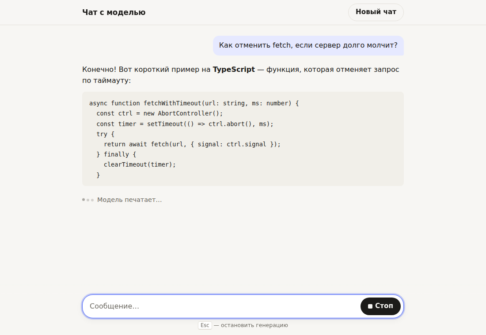
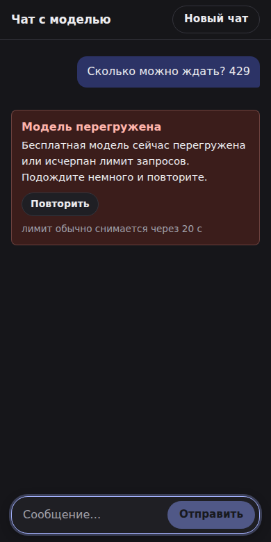

# Чат с моделью

Одностраничный веб-чат с языковой моделью через [OpenRouter](https://openrouter.ai): потоковый ответ,
остановка на середине, понятные ошибки, клавиатура и телефон. React 19 + TypeScript + Vite на фронте,
минимальный Node-сервер без фреймворков как прокси, который держит ключ.

<p>
  
  
</p>

## Запуск за пять минут

Нужен Node.js **22.12+**.

```bash
git clone <этот репозиторий> && cd ai-chat
npm install
cp .env.example .env        # и впишите OPENROUTER_API_KEY
npm run dev                 # http://localhost:5173
```

`npm run dev` поднимает два процесса: Node-сервер на `:8787` (ключ, стриминг) и Vite на `:5173`
(UI, проксирует `/api` на сервер). Модель задаётся в `.env` (`OPENROUTER_MODEL`), можно через запятую
несколько — OpenRouter сам переключится на следующую, если первая перегружена. Бесплатные модели в
каталоге регулярно меняются: если модель пропала, чат так и скажет, а актуальный список —
[здесь](https://openrouter.ai/models?max_price=0).

Продакшен-сборка — один процесс, который отдаёт и статику, и API:

```bash
npm run build && npm start  # http://localhost:8787
```

### Проверить краевые случаи без ключа

Настоящий 429 или обрыв по заказу не получить, поэтому в репозитории есть поддельный OpenRouter
(`scripts/mock-openrouter.ts`). Сценарий выбирается словом в сообщении:

```bash
npm run mock                                   # в отдельном терминале, :8788
# в .env:
#   OPENROUTER_API_KEY=mock
#   OPENROUTER_BASE_URL=http://127.0.0.1:8788/api/v1
#   FIRST_TOKEN_TIMEOUT_MS=5000   # чтобы не ждать таймауты по 45 с
#   IDLE_TIMEOUT_MS=5000
npm run dev
```

| Слово в сообщении | Что делает мок | Что видит пользователь |
|---|---|---|
| любое другое | длинный markdown-ответ по слову | текст по мере генерации, «Модель печатает…», кнопка «Стоп» |
| `429` | 429 + `Retry-After: 20` | «Модель перегружена», «Повторить», подсказка «лимит обычно снимается через N с» |
| `таймаут` | только keep-alive, ни одного токена | «Модель не ответила вовремя» (HTTP 504) |
| `зависни` | начинает отвечать и замолкает | часть текста остаётся, под ней — ошибка таймаута |
| `обрыв` | рвёт TCP-соединение посреди ответа | часть текста + «Проблема со связью» |
| `ошибка` | ошибка провайдера внутри потока | часть текста + «Ошибка модели» |
| `404` | модель не найдена | «Модель недоступна» с подсказкой поменять `OPENROUTER_MODEL` |

Потерю сети проверяю в DevTools → Network → Offline посреди ответа: генерация сразу обрывается
с «Пропало подключение к интернету», отправка блокируется, появляется плашка. Остановленный сервер —
«Сервер чата недоступен».

```bash
npm test          # vitest: SSE-парсер (включая куски по одному символу) и валидация запроса
npm run typecheck
```

## Как устроено

```
Браузер ──POST /api/chat──▶ Node-сервер ──POST /chat/completions (stream)──▶ OpenRouter
        ◀── NDJSON ────────             ◀── SSE ─────────────────────────────
  AbortController ─── закрытие соединения ──▶ AbortController ──▶ отмена генерации
```

```
server/
  index.ts        HTTP-сервер: /api/chat, /api/health, статика для прода
  openrouter.ts   запрос к OpenRouter, разбор потока, таймауты, перевод ошибок на человеческий язык
  sse.ts          инкрементальный SSE-парсер (+ тесты)
  validate.ts     проверка тела запроса, обрезка контекста (+ тесты)
  rateLimit.ts    лимит запросов с одного IP
shared/protocol.ts  типы, общие для клиента и сервера
src/
  api/chatStream.ts   fetch + чтение NDJSON как async-генератор
  hooks/useChat.ts    состояние диалога: отправка, стоп, повтор, сохранение
  components/         Composer, MessageList, MessageItem, ErrorNotice, EmptyState, Markdown…
scripts/mock-openrouter.ts
```

## Ключевые решения и почему так

**Ключ живёт только в процессе Node.** Браузер ходит на свой origin (`/api/chat`), ни одного запроса
к `openrouter.ai` со страницы нет, заголовка `Authorization` в браузере нет, в бандле ключа нет.
Сервер слушает только `127.0.0.1`. Модель и системный промпт задаются на сервере: клиент не может
попросить платную модель за наш счёт или подсунуть свой `system`. Прокси с ключом — это чужие деньги в
открытом доступе, поэтому «минимальный» не значит «без защиты»: валидация тела, лимит длины сообщения
и размера запроса, 20 запросов в минуту с IP.

**Стриминг: SSE от OpenRouter → NDJSON к браузеру.** Сервер не пробрасывает поток OpenRouter как есть,
а разбирает его и отдаёт свои простые события (`meta`, `delta`, `done`, `error`) по одному JSON на строку.
Клиент не знает о формате OpenRouter, keep-alive комментариях и о том, что ошибка провайдера может
прийти посреди потока с кодом 200. Поменять провайдера можно, не трогая фронт.

**`fetch` + `ReadableStream`, а не `EventSource`.** `EventSource` умеет только GET без тела и не
отменяется через `AbortController`. Нам нужен POST с историей и отмена одной строкой.

**Отмена — сквозная.** «Стоп» → `controller.abort()` в браузере → сервер видит закрытие соединения
(`res.on('close')`; не `req.on('close')` — в современных Node он срабатывает сразу после чтения тела) →
отменяет `fetch` к OpenRouter → генерация останавливается у провайдера. Без этого бесплатная модель
продолжала бы писать «в пустоту» и расходовать лимит. В моке видно по логу `клиент закрыл соединение`.

**Честные HTTP-статусы.** Сервер не отправляет `200`, пока не придёт первый токен. Поэтому 429, таймаут
до первого токена, недоступная модель видны во вкладке Network как 429/504/502 с JSON-телом. Ошибки
*после* начала ответа приходят событием `error` в потоке: статус к этому моменту уже ушёл.

**Таймауты в двух местах.** На сервере — 45 с до первого токена (бесплатные модели бывают в очереди)
и 30 с тишины между токенами. На клиенте — 60 с полной тишины на случай, если до браузера не дошло
вообще ничего (повисшее мобильное соединение). Keep-alive комментарии OpenRouter таймер не сбрасывают:
иначе модель, которая «думает» бесконечно, никогда бы не упала по таймауту.

**Повтор при 429 — ручной.** Автоматические повторы на бесплатном тарифе только быстрее выбирают лимит.
Человек видит, что случилось, примерное время до снятия лимита (из `Retry-After`/`X-RateLimit-Reset`)
и кнопку «Повторить». Кнопка не блокируется таймером: лимит может сняться раньше.

**Остановленный или оборванный ответ остаётся в истории и уходит в контекст.** Пользователь его видел
и может на него ссылаться («продолжи»). Пустые ответы (остановили до первого токена) в модель не
отправляются. Контекст — последние 30 сообщений, окно всегда начинается с реплики пользователя.

**История — в `sessionStorage`.** Переживает перезагрузку (F5, случайный свайп на телефоне — обидно
терять диалог), но умирает вместе с вкладкой. Это и есть «в рамках сессии»: на общем компьютере
переписка не остаётся лежать в браузере навсегда, а две вкладки не перетирают историю друг друга.
Если перезагрузить страницу посреди ответа, полученный текст сохранится со статусом «остановлено»
(дописываем на `pagehide`). Сервер ничего не хранит.

**Производительность стрима.** Токены приходят чаще, чем экран перерисовывается; они копятся и
попадают в состояние раз в кадр (`requestAnimationFrame`). Завершённые сообщения мемоизированы и
не перерисовываются, пока пишется новое.

**Markdown — безопасный.** `react-markdown` + GFM (таблицы, списки, код), без `rehype-raw`: HTML из ответа
модели не исполняется. Широкие таблицы и код скроллятся внутри себя, страница на телефоне не
разъезжается. У блоков кода кнопка «Копировать».

**Доступность.** `header`/`main`/`footer`, диалог — `ol` из `article`, у поля ввода настоящий `label`,
заголовки для навигации скринридером. Enter — отправить, Shift+Enter — перенос строки, Esc — стоп
(слушаем на `document`, работает где бы ни был фокус). «Отправить» и «Стоп» — одна и та же кнопка, поэтому
фокус не теряется, когда генерация начинается и заканчивается. После «Повторить» и «Новый чат» фокус
возвращается в поле ввода. Скринридер получает короткие сообщения о смене состояния через `aria-live`
(«Модель отвечает…», «Ответ получен», текст ошибки), а не каждый токен. Анимация индикатора печати
отключается при `prefers-reduced-motion`, есть поддержка режима высокой контрастности.

**UI.** Системный шрифт (без загрузки веб-шрифтов), тёмная тема по `prefers-color-scheme`, `100dvh` и
`safe-area-inset` для телефонов с «чёлкой», поле ввода 16px (иначе iOS зумит страницу при фокусе).
Пустое состояние объясняет, что умеет чат, и предлагает четыре примера. Автоскролл «прилипает» к низу,
только если пользователь сам внизу: если он прокрутил вверх почитать начало, его не дёргают.

## Где я сделал не так, как написано в задании

**«Уберите стандартную браузерную обводку фокуса (`outline`) у кнопок и поля ввода».** Не стал
убирать индикатор фокуса совсем. Без него интерфейсом нельзя пользоваться с клавиатуры: не видно, где
находишься. Это прямо противоречит требованию «полноценно пользоваться с клавиатуры, Tab по элементам»
и нарушает WCAG 2.4.7 (Focus Visible). Настоящая проблема из задания — разнобой между браузерами, и
её я решил: браузерный вид убран, вместо него один одинаковый везде `outline` по `:focus-visible`.
Мышью его не видно, только при навигации с клавиатуры. У поля ввода кольцо рисуется на всей
«капсуле» вокруг него. Именно `outline`, а не `box-shadow`: тени пропадают в режиме высокой
контрастности Windows.

**«Enter отправляет».** Сделал, но с оговорками, без которых это ломает ввод: Shift+Enter переносит
строку (иначе многострочное сообщение не написать), Enter во время IME-композиции (китайский,
японский ввод) не отправляет, а Enter во время генерации ничего не делает, но набранный текст не
пропадает.

**«Любая из бесплатных моделей».** Сделал, но одна захардкоженная бесплатная модель — хрупкое
решение: их убирают из каталога и перегружают. Поэтому модель задаётся в `.env`, можно указать
цепочку фолбэков, а «модели больше нет» — отдельная понятная ошибка, а не «что-то пошло не так».

**«Минимальный сервер или прокси».** Минимальным по коду остался (один файл роутинга, без
фреймворков), но не открытым: см. выше про валидацию, лимиты и `127.0.0.1`.

## Что сделал бы, будь ещё день

- **e2e-тесты в репозитории.** Сейчас сценарии из таблицы выше прогонялись Playwright-скриптом против мока
  вне репозитория; их стоит оформить как `@playwright/test` и запускать в CI вместе с `vitest`.
- **Время снятия лимита хранить абсолютным.** Сейчас после перезагрузки счётчик «лимит снимется через N с»
  у старой ошибки 429 начинается заново.
- **Защита от двойного клика.** «Отправить» и «Стоп» — одна кнопка: быстрый двойной клик отправит и сразу остановит.
- **Несколько диалогов** в боковой панели, переименование, экспорт в Markdown.
- **Редактирование своего сообщения** и «сгенерировать ещё вариант» для любого ответа, а не только последнего.
- **Учёт токенов, а не сообщений** при обрезке контекста (сейчас 30 последних сообщений).
- **Rate limit в Redis** и нормальный деплой (Fly/Render) с доверенным `X-Forwarded-For`.
- **Подсветка синтаксиса** в блоках кода (ленивой загрузкой, чтобы не раздувать бандл).
- **Переключатель темы** вручную поверх системной.

## ИИ-лог

**Инструменты:** Claude (Claude Code в облачной среде). Он написал код, тесты, мок OpenRouter и
прогнал сценарии через Playwright со скриншотами. Я прочитал итог, проверил на своём ключе
OpenRouter и разобрался в каждом решении из разделов выше.

**Где ИИ ошибся и как это всплыло:**

1. **Сохранение истории во время стрима не работало.** ИИ написал «сохранять не чаще раза в секунду»
   как `setTimeout` в `useEffect`, который перезапускается на каждое изменение `messages`. Токены идут
   непрерывно, поэтому таймер сбрасывался бесконечно, и до конца ответа не сохранялось ничего
   (debounce вместо throttle). Всплыло на e2e-прогоне «перезагрузка посреди ответа»: после F5
   пропадали и вопрос, и ответ. Исправлено на throttle по времени последнего сохранения плюс
   дозапись на `pagehide`.
2. **Во вкладке Network таймаут выглядел как `200 OK`.** Первая версия сервера отправляла заголовки
   сразу, как ответил OpenRouter, а он отвечает `200` ещё до первого токена. Таймаут до первого
   токена и ошибка провайдера приходили событием внутри «успешного» ответа. Заметил, когда гонял
   сценарии curl'ом по моку. Теперь `200` уходит только с первым токеном, раньше — честные 504/429/502.
3. **Событие `meta` дублировалось.** Условие «отправить модель, пока не пришёл текст» срабатывало на
   каждом служебном чанке до первого токена. Нашлось при чтении кода, заменено на явный флаг.
4. **Конец ответа уезжал под поле ввода.** Автоскролл через `scrollIntoView` на якорь в конце списка,
   а футер липкий и перекрывает низ страницы. Добавленная плашка «нет сети» закрыла и кнопку
   «Повторить». Увидел на скриншоте; теперь скроллится само окно до конца документа.
5. **Двойное кольцо фокуса у поля ввода** (border + outline с отступом) и **двухстрочное пустое поле
   на телефоне** (длинный плейсхолдер переносился, авторост считал высоту по нему). Оба пойманы на
   скриншотах светлой/тёмной темы и ширины 375px.

## Лицензия

[MIT](LICENSE)
